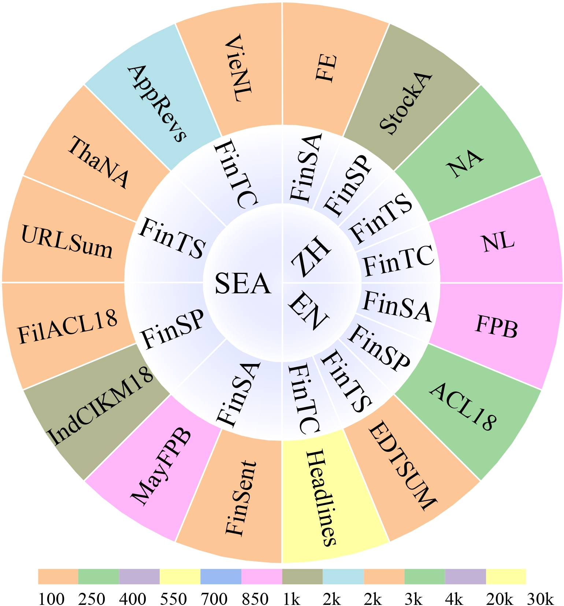

# CroFinben: Multilingual Benchmarking of LLMs for Cross Mainstream and Low-resource Finance

   
## 📘Introduction

<div style="display: flex; align-items: flex-start;">
  <div style="flex: 1;text-align: justify;">
    <!-- 这里放你的文字内容 -->
    <p>
      Welcome to here, let's get to know CroFinben together. </br>
      Given the current situation where existing benchmarks in finance still struggle with cross-language generalization and cross-domain knowledge transfer, we introduce <b>CroFinBen</b> —— the first multilingual benchmark <b>specifically designed to bridge the language-resource gap between mainstream and low-resource finance</b>. It includes <b>4 key financial tasks</b> (FinSA, FinSP, FinTS, and FinTC) in both <b>high-resource languages</b> (English and Chinese) and <b>low-resource SEA languages</b> (Indonesian, Malaysian, Thai, Filipino, and Vietnamese), comprising 50k samples from 16 datasets to ensure a comprehensive and balanced evaluation. It enhances the fairness and robustness of FinLLMs, providing strong support for improving performance  in global financial scenarios.
The language and data distribution of required capabilities for CroFinben benchmark is shown on the right.
    </p>
  </div>
  
</div>

---

### 🗣️Languages

- high-resource languages: - [EN] - [ZH]
- low-rescoure languages: -[Tha] - [Ind]  - [Vie]  - [May]  - [Fil]

### 🖥️Evaluations

There are four financial tasks in total: FinSA, FinSP, FinTS, and FinTC

The information about the datasets are as follows:


> 🎭️Financial Sentiment Analysis (FinSA):
- [FE (ZH)](https://huggingface.co/datasets/CroFinAI/FE)
- [FPB (EN)](https://huggingface.co/datasets/CroFinAI/FPB)
- [FinSent (Ind)](https://huggingface.co/datasets/CroFinAI/FinSent)
- [MayFPB (May)](https://huggingface.co/datasets/CroFinAI/MayFPB)

> 💹Financial Stock Prediction (FinSP):
- [StockA (ZH)](https://huggingface.co/datasets/CroFinAI/StockA)
- [ACL18 (EN)](https://huggingface.co/datasets/CroFinAI/ACL18)
- [IndCIKM18 (Ind)](https://huggingface.co/datasets/CroFinAI/IndCIKM18)
- [FilACL18 (Fil)](https://huggingface.co/datasets/CroFinAI/FilACL18)

> 📃Financial Text Summary (FinTS):
- [NA (ZH)](https://huggingface.co/datasets/CroFinAI/NA)
- [EDTSUM (EN)](https://huggingface.co/datasets/CroFinAI/EDTSUM)
- [URLSum (Ind)](https://huggingface.co/datasets/CroFinAI/URLSum)
- [ThaNA (Tha)](https://huggingface.co/datasets/CroFinAI/ThaNA)

> 💡Financial Text Classification (FinTC):

- [NL (ZH)](https://huggingface.co/datasets/CroFinAI/NL)
- [Headlines (EN)](https://huggingface.co/datasets/CroFinAI/Headlines)
- [AppRews (Ind)](https://huggingface.co/datasets/CroFinAI/AppRews)
- [VieNL (Vie)](https://huggingface.co/datasets/CroFinAI/VieNL)


### Key Breakthroughs


- **Breaking high- and low-resource cross-lingual barrier**: CroFinBen is the first benchmark supporting cross-mainstream and low-resource finance, particularly SEA languages (Ind, Tha, Fil, Vie, and May), filling the gap in low-resource financial tasks.
- **Highly localized annotation for low-resource dataset**: Unlike other benchmarks that rely on direct translations, CroFinBen works with SEA domain experts to refine financial terms, removing finance- and culture-specific elements to better meet local needs. 
- **Fairness in high- and low-resource task consistency**: Ensures fair evaluation via consistent NLP main tasks across both high- and low-resource languages, eliminating biases that arise from differing task complexities in existing methods.
- **Comprehensive evaluation of multi-language tasks**: Conducts an in-depth evaluation of 23 representative general, SEA LLMs and FinLLMs, revealing their strengths and limitations in adapting to both high- and low-resource financial environments.

---

## CroFinben Evalution Benchmark results


The table below shows the overview of CroFinBen benchmark: financial tasks (FinTask), NLP main tasks (NLP), languages (Lang), datasets, specific financial tasks, data sizes, evaluation metrics, data sources, creation methods, text lengths (Sentence/Passage/Paragraph), and licenses.


| FinTask | Language | Dataset   | Specific task           | Evaluation | Evaluation                                       | Source                    | types          | Textual Hierarchy | License      | NLP Task             |
|---------|----------|-----------|-------------------------|------------|--------------------------------------------------|---------------------------|----------------|-------------------|--------------|----------------------|
| FinSA     | ZH       | FE        | sentiment analysis      | 2020       | F1, Accuracy, Macro F1                           | social texts              | raw collection | Sentence          | Public       | Classification (CLS) |
|         | EN       | FPB       | sentiment analysis      | 970        | F1, Accuracy, Macro F1                           | economic news             | raw collection | Sentence          | CC BY-SA 3.0 |                      |
|         | Ind      | FinSent   | sentiment analysis      | 2000       | F1, Accuracy, Macro F1                           | News Headlines            | raw collection | Sentence          | Apache-2.0   |                      |
|         | May      | MayFPB    | sentiment analysis      | 970        | F1, Accuracy, Macro F1                           | Economic News             | expert review  | Paragraph         | MIT License  |                      |
| FinSP      | ZH       | StockA    | stock prediction        | 1477       | F1, Accuracy, Macro F1                           | news,historical prices    | raw collection | Paragraph         | Public       | Reasoning (REA)      |
|         | EN       | ACL18     | stock prediction        | 3720       | F1, Accuracy, Macro F1                           | tweets, historical prices | raw collection | Paragraph         | MIT License  |                      |
|         | Ind      | IndCIKM18 | stock prediction        | 1139       | F1, Accuracy, Macro F1                           | tweets Stock Prices       | expert review  | Paragraph         | Public       |                      |
|         | Fil      | FilACL18  | stock prediction        | 2000       | F1, Accuracy, Macro F1                           | Tweets, Stock prices      | expert review  | Paragraph         | MIT License  |                      |
| FinTS     | ZH       | NA        | text summarization      | 3600       | Rouge-1, Rouge-2, Rouge-L,  BERTScore, BARTScore | news, announcements       | raw collection | Paragraph         | Public       | Generation (GEN)     |
|         | EN       | EDTSUM    | text summarization      | 2000       | Rouge-1, Rouge-2, Rouge-L,  BERTScore, BARTScore | news articles             | raw collection | Paragraph         | Public       |                      |
|         | Ind      | URLSum    | url summarization       | 2834       | Rouge-1, Rouge-2, Rouge-L,  BERTScore, BARTScore | Indonesian News URLs      | raw collection | Paragraph         | Public       |                      |
|         | Tha      | ThaNA     | text summarization      | 2000       | Rouge-1, Rouge-2, Rouge-L,  BERTScore, BARTScore | news, announcements       | expert review  | Paragraph         | Public       |                      |
| FinTC     | ZH       | NL        | news classification     | 884        | F1, Accuracy, Macro F1                           | news articles             | raw collection | Paragraph         | Public       | Classification (CLS) |
|         | EN       | Headlines | headline classification | 20547      | Avg F1                                           | news headlines            | raw collection | Sentence          | CC BY-SA 3.0 |                      |
|         | Ind      | AppRevs   | financial review        | 1999       | F1, Accuracy, Macro F1                           | Mandiri App Reviews       | raw collection | Sentence          | CC BY-NC 4.0 |                      |
|         | Vie      | VieNL     | news classification     | 2000       | F1, Accuracy, Macro F1                           | news articles             | expert review  | Paragraph         | Public       |                      |
|         |          |           |                         |            |                                                  |                           |                |                   |              |                      |


### The evaluation results of 23 representative large models on CroFinben


| Model        |Finanical Task |        |        |        | NLP Task |        |        | language |        |        | overall |
|--------------|----------------|--------|--------|--------|----------|--------|--------|----------|--------|--------|---------|
|              | FinSA            | FinSP     | FinTS    | FinTC      | CLS      | GEN    | REA    | EN       | ZH     | SEA    |         |
| LLaMa2       | 0.262          | 0.333  | 0.219  | 0.322  | 0.292    | 0.219  | 0.333  | 0.357    | 0.195  | 0.299  | 0.284   |
| LLaMa2-Chat  | 0.356          | 0.365  | 0.236  | 0.314  | 0.335    | 0.236  | 0.365  | 0.413    | 0.269  | 0.271  | 0.318   |
| Llama3       | 0.276          | 0.298  | 0.237  | 0.314  | 0.295    | 0.237  | 0.298  | 0.410    | 0.144  | 0.290  | 0.281   |
| Gemma        | 0.328          | 0.332  | 0.248  | 0.377  | 0.352    | 0.248  | 0.332  | 0.432    | 0.224  | 0.308  | 0.321   |
| BLOOM        | 0.284          | 0.324  | 0.162  | 0.335  | 0.310    | 0.162  | 0.324  | 0.376    | 0.309  | 0.144  | 0.276   |
| ChatGPT(3.5) | 0.625          | 0.400  | 0.245  | 0.586  | 0.605    | 0.245  | 0.400  | 0.538    | 0.391  | 0.463  | 0.464   |
| Qwen         | 0.485          | 0.370  | 0.193  | 0.359  | 0.422    | 0.193  | 0.370  | 0.479    | 0.274  | 0.301  | 0.352   |
| Qwen2        | 0.532          | 0.431  | 0.332  | 0.318  | 0.425    | 0.332  | 0.431  | 0.409    | 0.349  | 0.452  | 0.403   |
| Baichuan     | 0.248          | 0.297  | 0.145  | 0.274  | 0.261    | 0.145  | 0.297  | 0.355    | 0.177  | 0.191  | 0.241   |
| Baichuan2    | 0.050          | 0.270  | 0.144  | 0.219  | 0.134    | 0.144  | 0.270  | 0.275    | 0.033  | 0.204  | 0.171   |
| ChatGLM2     | 0.000          | 0.168  | 0.116  | 0.201  | 0.101    | 0.116  | 0.168  | 0.252    | 0.032  | 0.081  | 0.121   |
| ChatGLM3     | 0.482          | 0.372  | 0.269  | 0.397  | 0.440    | 0.269  | 0.372  | 0.537    | 0.376  | 0.227  | 0.380   |
| DeepSeek     | 0.333          | 0.303  | 0.245  | 0.348  | 0.340    | 0.245  | 0.303  | 0.420    | 0.226  | 0.275  | 0.307   |
| Internlm     | 0.304          | 0.313  | 0.218  | 0.324  | 0.314    | 0.218  | 0.313  | 0.393    | 0.274  | 0.202  | 0.290   |
| SeaLLM-v2    | 0.460          | 0.429  | 0.333  | 0.446  | 0.453    | 0.333  | 0.429  | 0.443    | 0.366  | 0.442  | 0.417   |
| SeaLLM-v2.5  | 0.538          | 0.422  | 0.339  | 0.440  | 0.489    | 0.339  | 0.422  | 0.447    | 0.396  | 0.461  | 0.435   |
| SeaLLM-v3    | 0.552          | 0.426  | 0.326  | 0.343  | 0.447    | 0.326  | 0.426  | 0.408    | 0.369  | 0.458  | 0.412   |
| Polylm       | 0.000          | 0.236  | 0.038  | 0.200  | 0.100    | 0.038  | 0.236  | 0.255    | 0.012  | 0.088  | 0.118   |
| Typhoon      | 0.335          | 0.382  | 0.202  | 0.309  | 0.322    | 0.202  | 0.382  | 0.396    | 0.251  | 0.274  | 0.307   |
| PhoGPT       | 0.082          | 0.258  | 0.206  | 0.265  | 0.174    | 0.206  | 0.258  | 0.296    | 0.135  | 0.178  | 0.203   |
| FinMA        | 0.467          | 0.267  | 0.211  | 0.279  | 0.373    | 0.211  | 0.267  | 0.406    | 0.227  | 0.284  | 0.306   |
| CFGPT        | 0.202          | 0.254  | 0.152  | 0.236  | 0.219    | 0.152  | 0.254  | 0.338    | 0.152  | 0.143  | 0.211   |
| DISC-FinLLM  | 0.559          | 0.409  | 0.260  | 0.308  | 0.433    | 0.260  | 0.409  | 0.504    | 0.310  | 0.338  | 0.384   |
|              |                |        |        |        |          |        |        |          |        |        |         |


## 🔧 Environment Setup

### Locally install
```bash

cd CroFinben
pip install -r requirements.txt
cd src/financial-evaluation
pip install -e .[multilingual]
```

1. Commercial APIs


Please note, for tasks such as NA, the automated evaluation is based on a specific pattern. This might fail to extract relevant information in zero-shot settings, resulting in relatively lower performance compared to previous human-annotated results.

```bash
export OPENAI_API_SECRET_KEY=YOUR_KEY_HERE
python eval.py \
    --model chatgpt \
    --tasks CroFinben_NA
```

2. Self-Hosted Evaluation

To run inference backend:

```bash
bash scripts/run_interface.sh
```

Please adjust run_interface.sh according to your environment requirements.

To evaluate:

```bash
python data/*/evaluate.py
```

### Create new tasks

Creating a new task for CroFinben involves creating a Huggingface dataset and implementing the task in a Python file. This guide walks you through each step of setting up a new task using the CroFinben framework.

#### Creating your dataset in Huggingface

Your dataset should be created in the following format:

```python
{
    "query": "...",
    "answer": "...",
    "text": "..."
}
```

In this format:

- `query`: Combination of your prompt and text
- `answer`: Your label

#### Predefined task metrics

| Task                                     | Metric                                 | Illustration                                                 |
| ---------------------------------------- | -------------------------------------- | ------------------------------------------------------------ |
| Classification                           | Accuracy                               | This metric represents the ratio of correctly predicted observations to total observations. It is calculated as (True Positives + True Negatives) / Total Observations. |
| Classification                           | F1 Score                               | The F1 Score represents the harmonic mean of precision and recall, thereby creating an equilibrium between these two factors. It proves particularly useful in scenarios where one factor bears more significance than the other. The score ranges from 0 to 1, with 1 signifying perfect precision and recall, and 0 indicating the worst case. Furthermore, we provide both 'weighted' and 'macro' versions of the F1 score. |
| Classification                           | Macro F1 |The Macro F1 is a metric that evaluates the overall performance of a multi-class classification model by computing the unweighted average of the F1 scores for each class. It provides a balanced measure of precision and recall across all classes, with a score ranging from 0 to 1. A score of 1 indicates perfect precision and recall for all classes, while a score of 0 reflects poor performance, with the model failing to correctly identify any class. |
| Extractive and Abstractive Summarization | Rouge-N                                | This measures the overlap of N-grams (a contiguous sequence of N items from a given sample of text) between the system-generated summary and the reference summary. 'N' can be 1, 2, or more, with ROUGE-1 and ROUGE-2 being commonly used to assess unigram and bigram overlaps respectively. |
| Extractive and Abstractive Summarization | Rouge-L                                | This metric evaluates the longest common subsequence (LCS) between the system and the reference summaries. LCS takes into account sentence level structure similarity naturally and identifies longest co-occurring in-sequence n-grams automatically. |
| Extractive and Abstractive Summarization | BERTScore | BERTScore measures the semantic similarity between the system-generated summary and the reference summary by computing contextualized embeddings with BERT. It evaluates precision, recall, and F1 score based on token similarity, providing a nuanced assessment of semantic content beyond exact match. |
| Extractive and Abstractive Summarization | BARTScore | BARTScore assesses the quality of generated summaries by estimating the likelihood of the candidate given the reference (or vice versa) using a pretrained BART model. It captures fluency and relevance through probability scores, effectively evaluating the coherence and informativeness of the summaries. |

>  Additionally, you can determine if the labels should be lowercased during the matching process by specifying `LOWER_CASE` in your class definition. This is pertinent since labels are matched based on their appearance in the generated output. For tasks like examinations where the labels are a specific set of capitalized letters such as 'A', 'B', 'C', this should typically be set to False.

